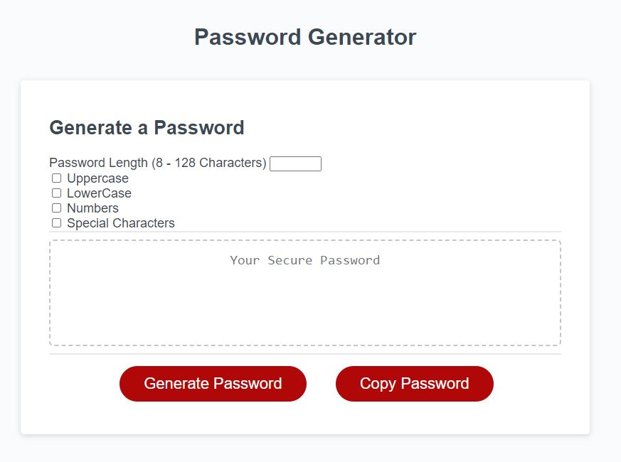
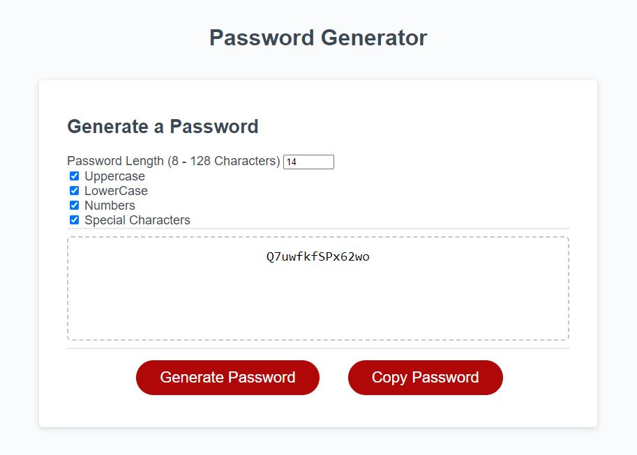
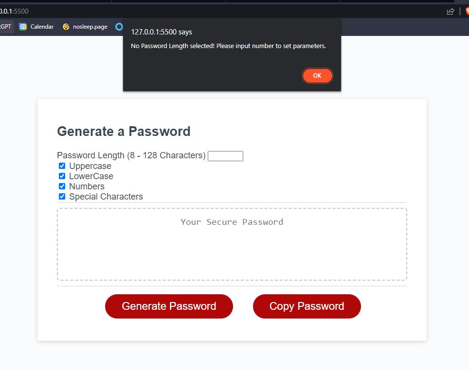
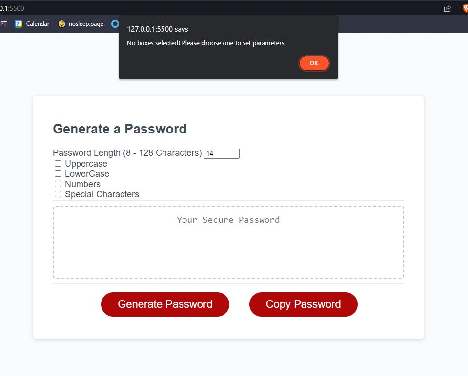
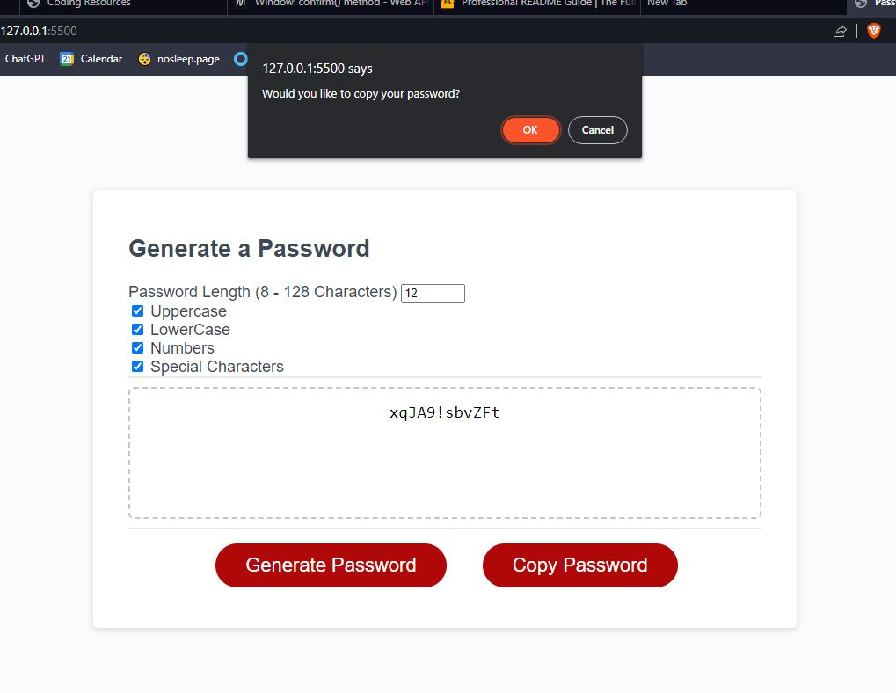
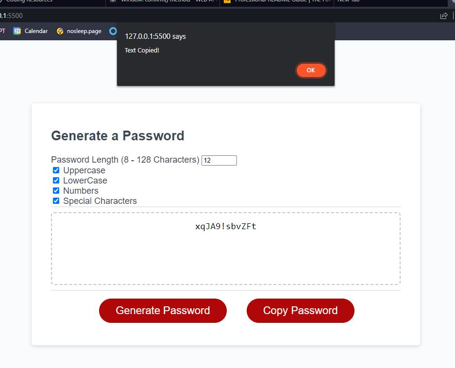
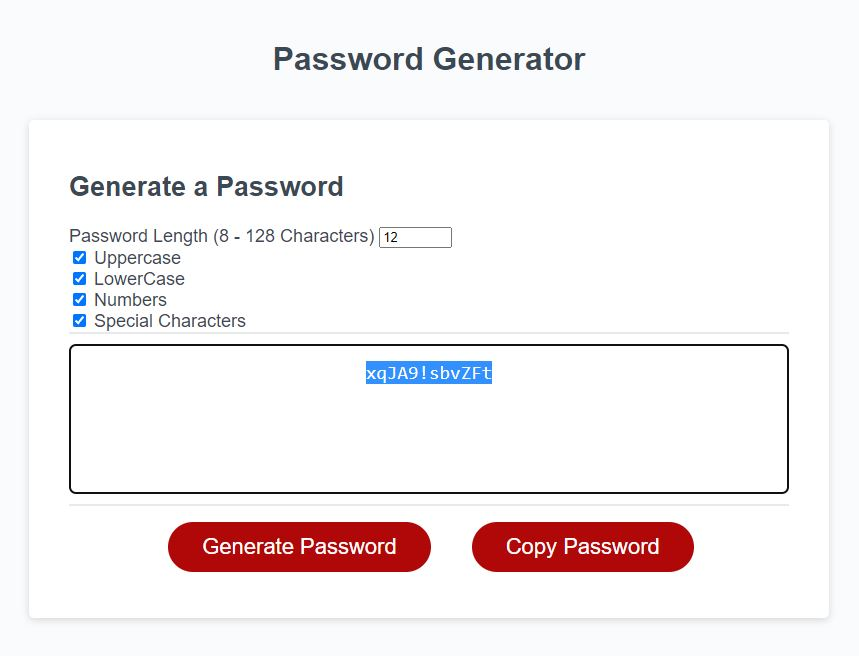

# Password Generator (UCSD-Challenge 3)

## Description

- In the current technological climate, security has become a big concern.
- This random password generator can create passwords within certain parameters.
- I will personally use this website to create quick secure passwords for future accounts.
- This has honed my JavaScript skills in creating an interactible website.
- **NOTE: In consideration to the User's website experience and User interface, buttons and a number entry box is present in replacement to a sequence of prompts to process password parameters. alert() and confirm() methods are present in code in accordance to error messages and user choice confirmations, however.**

## Features

- Custom Password Length Number Entry (8 - 128 Character Limit)
- Upper & LowerCase, Numbers, and Special Character choices
- Copy Password Function

## Installation

**No special installation procedure is needed. Live deployment is on GitPages. Access within repo page.**

## Usage

- When first loading the page, you will be presented with this page.

- You are able to set your password parameters under 'Generate a Password' with your desired password length, upper & lower case, numbers, and special characters.
- For this example, I made the password length of 14 characters, and all characters are enabled for generation. After pressing the 'Generate Password' button, you will be presented with your newly generated password in the dotted box!

- If no password length is chosen, but boxes are checked, you will be presented with this alert message box.

- If no password character boxes are chosen, but password length has been chosen, you will be presented with this alert message box.
- If nothing is chosen, you will get both error boxes above and below in sequence.

- The password generator is able to also copy your password automatically upon clicking the 'Copy Password' button. When clicking the button, you will prompted to confirm your choice to copy your password. Upon confirmation, the password will be selected and copied, and you will get an alert message confirming this process.

## Credits

- [A Stack Overflow page really helped in creating the password generation function](https://stackoverflow.com/questions/1349404/generate-random-string-characters-in-javascript).

## License

MIT License

Copyright (c) 2023 Ray Badua

Permission is hereby granted, free of charge, to any person obtaining a copy
of this software and associated documentation files (the "Software"), to deal
in the Software without restriction, including without limitation the rights
to use, copy, modify, merge, publish, distribute, sublicense, and/or sell
copies of the Software, and to permit persons to whom the Software is
furnished to do so, subject to the following conditions:

The above copyright notice and this permission notice shall be included in all
copies or substantial portions of the Software.

THE SOFTWARE IS PROVIDED "AS IS", WITHOUT WARRANTY OF ANY KIND, EXPRESS OR
IMPLIED, INCLUDING BUT NOT LIMITED TO THE WARRANTIES OF MERCHANTABILITY,
FITNESS FOR A PARTICULAR PURPOSE AND NONINFRINGEMENT. IN NO EVENT SHALL THE
AUTHORS OR COPYRIGHT HOLDERS BE LIABLE FOR ANY CLAIM, DAMAGES OR OTHER
LIABILITY, WHETHER IN AN ACTION OF CONTRACT, TORT OR OTHERWISE, ARISING FROM,
OUT OF OR IN CONNECTION WITH THE SOFTWARE OR THE USE OR OTHER DEALINGS IN THE
SOFTWARE.
